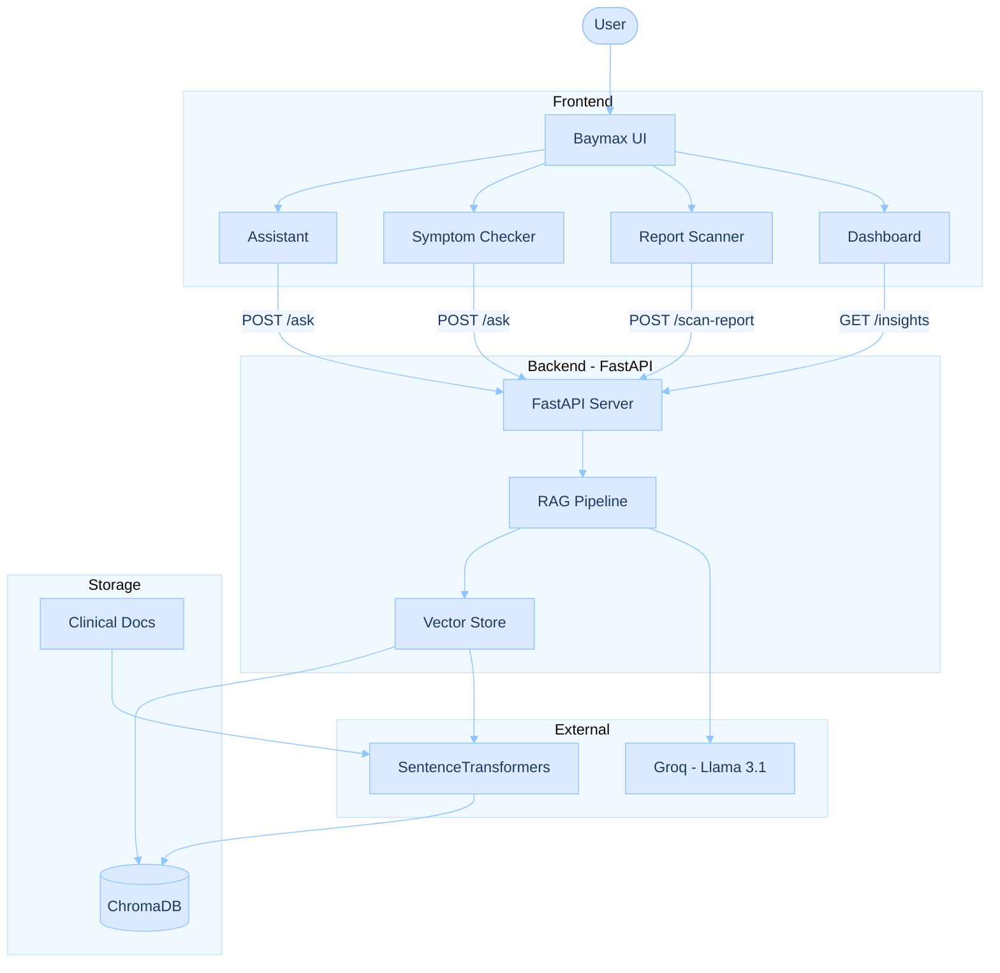

# 🤖 Baymax — Your Personal Healthcare Assistant

> A RAG-powered clinical AI assistant built with FastAPI, ChromaDB, and LangChain. Baymax helps users understand their symptoms, scan medical reports, and get AI-generated health insights — all in a clean, friendly interface inspired by the Disney character.


---

## ✨ Features

### 🏠 Insights Dashboard
- **Sleep Quality Tracker** — Enter your bedtime and wake time to get a visual sleep quality breakdown with a phase bar (Light, Deep, REM, Awake)
- **AI Health Insights** — Three AI-generated cards loaded on every visit: a health fact, a wellness tip, and a daily reminder — all powered by your RAG pipeline
- **Ask Baymax Widget** — Ask a quick health question directly from the dashboard without switching tabs

### 💬 AI Assistant
- Full conversational chat interface with Baymax
- Answers grounded in a clinical research vector store (ChromaDB)
- Auto-generates data visualizations (bar charts) when the response contains statistics or percentages
- Shows retrieved source chunks with confidence scores for transparency

### 🩺 Symptom Checker
- Interactive Baymax body map — click on head, chest, abdomen, arms, or legs to select a region
- Add multiple symptoms with body region tags
- AI generates top 3 possible conditions with severity levels (Mild / Moderate / Serious) and plain-language explanations

### 📄 Report Scanner
- Upload blood test reports, lab results, or clinical notes (PDF, JPG, PNG)
- AI parses and structures every parameter as NORMAL or ABNORMAL
- Visual donut chart summary showing flagged vs normal values at a glance
- Plain-language explanations and recommendations for each parameter

---

## 🧠 How It Works

Baymax uses a **Retrieval-Augmented Generation (RAG)** architecture:

```
User Query
    │
    ▼
ChromaDB Vector Store
(clinical research embeddings)
    │
    ▼
Top-K Relevant Chunks Retrieved
    │
    ▼
LLM (via LangChain) generates answer
grounded in retrieved context
    │
    ▼
Response + Source Chunks returned to UI
```

This means answers are not hallucinated from general training data — they are grounded in the specific clinical documents you've ingested into the vector store.

---

## 🗂️ Project Structure

```
clinical-rag/
│
├── app/                        # FastAPI web application
│   ├── main.py                 # API routes and server
│   ├── static/
│   │   ├── app.js              # Frontend JS (chat, symptoms, report scanner, dashboard)
│   │   ├── style.css           # All styling
│   │   └── images/
│   │       ├── baymax-hi.png   # Baymax waving image (dashboard)
│   │       ├── screen.png      # Baymax body map (symptom checker)
│   │       ├── baymaxx.png     # Alternate Baymax image
│   │       └── favicon.png     # Browser tab icon
│   └── templates/
│       └── index.html          # Main HTML template (Jinja2)
│
├── src/                        # Core RAG pipeline
│   ├── __init__.py
│   ├── chunk.py                # Document chunking logic
│   ├── ingest.py               # Data ingestion into ChromaDB
│   ├── rag.py                  # RAG chain construction and query logic
│   └── vectorstore.py          # ChromaDB setup and retrieval
│
├── data/                       # Raw documents (gitignored)
├── chroma_db/                  # Persistent vector store (gitignored)
├── .env                        # API keys (gitignored)
├── .gitignore
└── README.md
```

---

## 🚀 Getting Started

### Prerequisites

- Python 3.10+
- An OpenAI API key (or compatible LLM provider)
- pip

### 1. Clone the repository

```bash
git clone https://github.com/purrieie/baymax-healthcare-chatbot.git
cd baymax-healthcare-chatbot
```

### 2. Create and activate a virtual environment

```bash
python -m venv venv
source venv/bin/activate        # macOS/Linux
venv\Scripts\activate           # Windows
```

### 3. Install dependencies

```bash
pip install -r requirements.txt
```

> If you don't have a `requirements.txt` yet, generate one with:
> ```bash
> pip freeze > requirements.txt
> ```

### 4. Set up your environment variables

Create a `.env` file in the root directory:

```env
OPENAI_API_KEY=your_openai_api_key_here
```

### 5. Ingest your documents

Place your clinical documents (PDFs, text files) in the `data/` folder, then run:

```bash
python src/ingest.py
```

This chunks your documents and stores embeddings in ChromaDB at `chroma_db/`.

### 6. Run the app

```bash
uvicorn app.main:app --reload
```

Open your browser at `http://localhost:8000`

---

## 🔌 API Endpoints

| Method | Endpoint | Description |
|--------|----------|-------------|
| `GET` | `/` | Serves the main HTML page |
| `POST` | `/ask` | Ask a health question — returns answer + source chunks |
| `POST` | `/scan-report` | Upload and analyze a medical report |
| `GET` | `/insights` | Returns 3 AI-generated health insight cards |

### `/ask` — Request body
```json
{
  "question": "What are the symptoms of hypertrophic cardiomyopathy?"
}
```

### `/ask` — Response
```json
{
  "answer": "Hypertrophic cardiomyopathy (HCM) is characterized by...",
  "sources": ["doc1.pdf", "doc2.pdf"],
  "chunks": [
    {
      "text": "HCM presents with dyspnea on exertion...",
      "pmid": "HCM-12345",
      "score": 0.87
    }
  ]
}
```

### `/scan-report` — Request body
```json
{
  "filename": "blood_report.pdf",
  "data": "<base64_encoded_file>",
  "type": "application/pdf"
}
```

### `/insights` — Response
```json
{
  "insights": [
    { "topic": "Did You Know?", "insight": "Your nose can detect over 1 trillion scents..." },
    { "topic": "Today's Tip", "insight": "Take 5 deep breaths every hour..." },
    { "topic": "Quick Reminder", "insight": "Drink a glass of water right now..." }
  ]
}
```

---

## 🛠️ Tech Stack

| Layer | Technology |
|-------|-----------|
| Backend | FastAPI (Python) |
| Vector Store | ChromaDB |
| LLM Orchestration | LangChain |
| Embeddings | OpenAI / HuggingFace |
| Frontend | Vanilla HTML, CSS, JavaScript |
| Charts | Chart.js |
| Fonts | DM Sans (Google Fonts) |
| Server | Uvicorn |

---

## 📸 Screenshots

### Dashboard
The main insights page with sleep tracker, AI health cards, and quick-ask widget.


### AI Assistant
Full chat interface with source citations and auto-generated data visualizations.


### Symptom Checker
Interactive body map with AI-powered condition analysis.


### Report Scanner
Upload medical reports and get structured NORMAL/ABNORMAL breakdowns with a visual summary chart.


---
## 🏗️ Architecture


---

## ⚠️ Disclaimer

Baymax is an educational and informational tool only. It is **not** a substitute for professional medical advice, diagnosis, or treatment. Always consult a qualified healthcare professional for medical concerns.

---

## 👩‍💻 Author

Made with love (and a lot of debugging) by [@purrieie](https://github.com/purrieie)

---

## 📄 License

MIT License — feel free to fork, build on, and improve Baymax.
